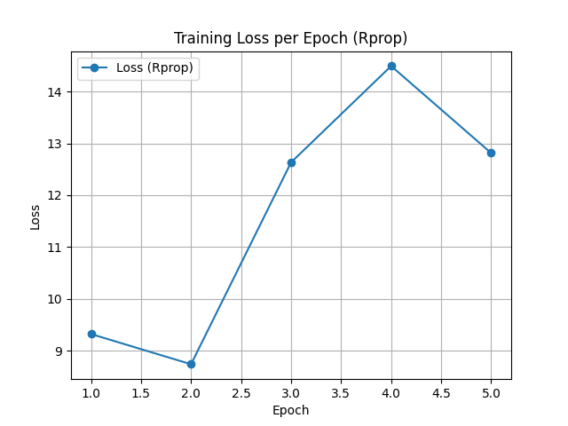
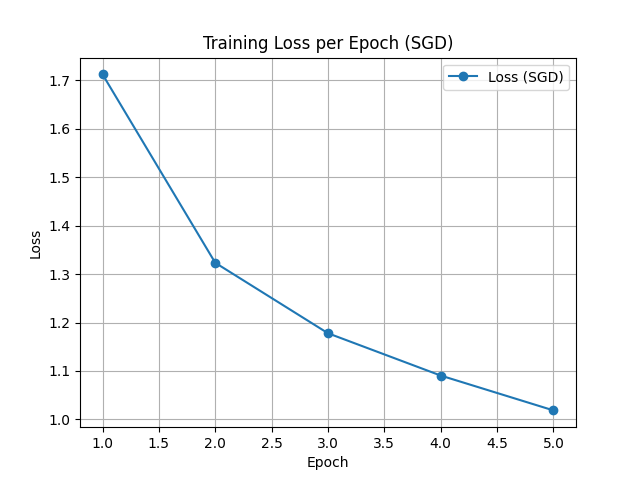

# Optimize computer vision models

Rprop:
- На первой эпохе наблюдается относительно низкая потеря, но затем она уменьшается на второй эпохе.
- После этого на третьей и четвертой эпохах потеря значительно увеличивается, достигая пика.
- К пятой эпохе потеря снова уменьшается, но всё равно остаётся выше, чем в начале.

SGD:
- Потеря систематически снижается с каждой эпохой.
- Начальная потеря высока, но за каждую следующую эпоху происходит стабильное уменьшение.

Выводы:
- Rprop показывает нестабильное поведение функции потерь, возможно, из-за особенностей алгоритма адаптации шага.
- SGD демонстрирует более стабильное и последовательное уменьшение потерь, что может указывать на более эффективное обучение в данном случае.

