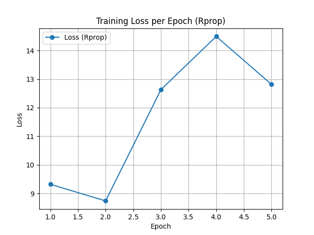
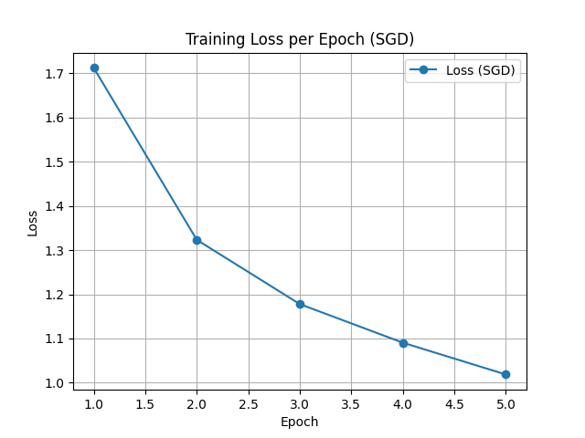

# Optimize computer vision models
Практика по курсу "Оптимизация моделей компьютерного зрения"

# Задание 2

На данных графиках представлена динамика изменения потерь для двух различных алгоритмов обучения: Rprop и SGD (Stochastic Gradient Descent).

### Rprop:
- На первой эпохе наблюдается относительно низкая потеря, но к четвертой эпохе она достигает своего пика. После этого на пятой эпохе потеря снова уменьшается. Такое непоследовательное поведение может быть связано с тем, что Rprop, фокусируясь на знаках градиента, мог игнорировать величину градиента, что в некоторых случаях приводит к нестабильности.
- Особенности алгоритма: Rprop адаптирует шаг на основе изменений знака градиента, что может помочь на большом кол-ве эпох, но иногда приводит к колебаниям в начале обучения.


### SGD:
- Демонстрирует стабильное и последовательное уменьшение потерь на каждой эпохе. 
- Постепенное и последовательное уменьшение потерь свидетельствует о надежности и предсказуемости SGD.
- Хорошо подходит для задач, где стабильность и предсказуемость важны, особенно на начальных этапах обучения.

### Выводы
- Предпочтительность алгоритма: Исходя из графиков, если основная цель — максимальная стабильность и предсказуемость при снижении потерь на небольшом числе эпох, предпочтительным вариантом станет SGD. Однако если задача требует более тонкой настройки и допускает колебания на начальных этапах, Rprop может оказаться подходящим.




# Задание 3 

Оптимизация гиперпараметров с помощью optune.

Датасет FashionMnist был заменен на датасет CIFAR-10

Поиск должен был осуществляться по данным гиперпараметра: ("dropout", 0.2, 0.5) ; ("optimizer", ["Adam", "RMSprop", "SGD"])


Вывод консоли:
```Study statistics: 
  Number of finished trials:  46
  Number of pruned trials:  35
  Number of complete trials:  11
Best trial:
  Value:  0.53359375
  Params: 
    n_layers: 2
    n_units_l0: 256
    dropout_l0: 0.30550577988150257
    n_units_l1: 365
    dropout_l1: 0.30404827709049087
    optimizer: Adam
    lr: 0.00343815733716052
```


## Задание №4

## Результаты работы Torch Onnx модели

| Класс | Torch (Точность %) | Onnx (Точность %) |
|--------|--------------------|-------------------|
| Plane | 56.2               | 56.2              |
| Car    | 31.5               | 31.5              |
| Bird   | 22.1               | 22.1              |
| Cat    | 29.3               | 29.3              |
| Deer   | 40.5               | 40.5              |
| Dog    | 43.9               | 43.9              |
| Frog   | 57.8               | 57.8              |
| Horse | 72.1               | 72.1              |
| Ship   | 60.7               | 60.7              |
| Truck | 77.2               | 77.2              |
Время выполнения Torch: 0.5682 ms
Время выполнения Onnx : 0.4023 мс

Модель onnx предсказывает в 1.41 раза быстрее.
Точность у обеих моделей идентична, следовательно, конвертация моделей прошла успешно.
